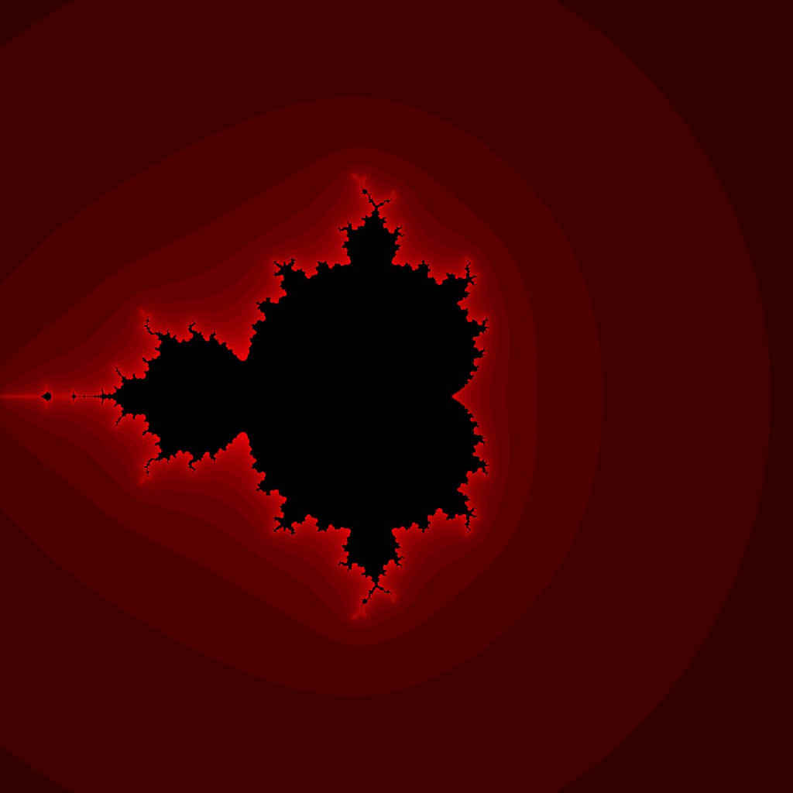
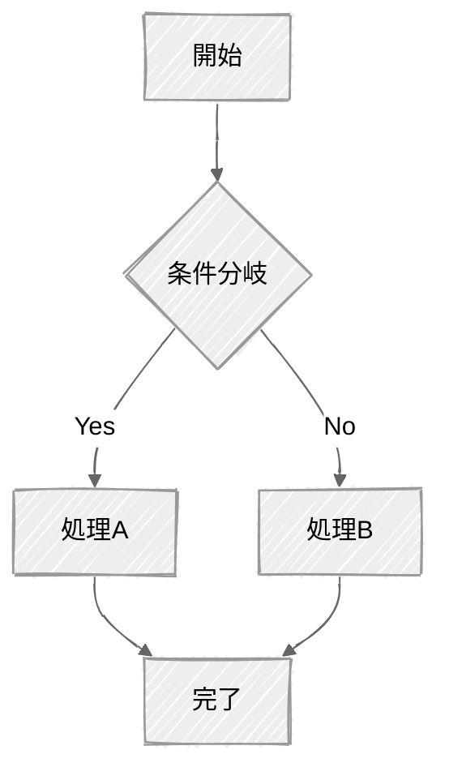
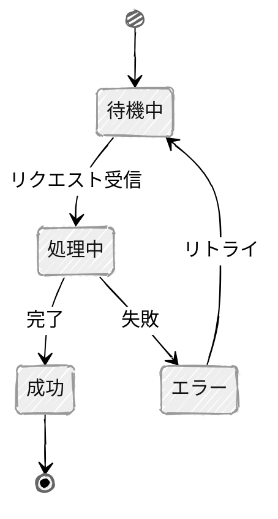
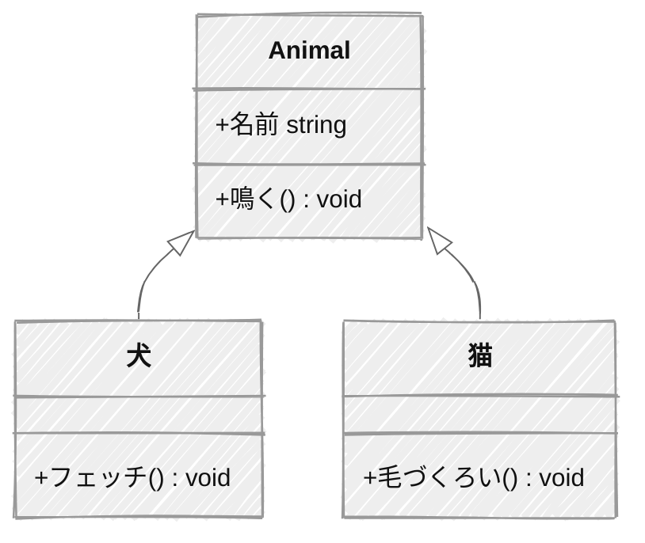
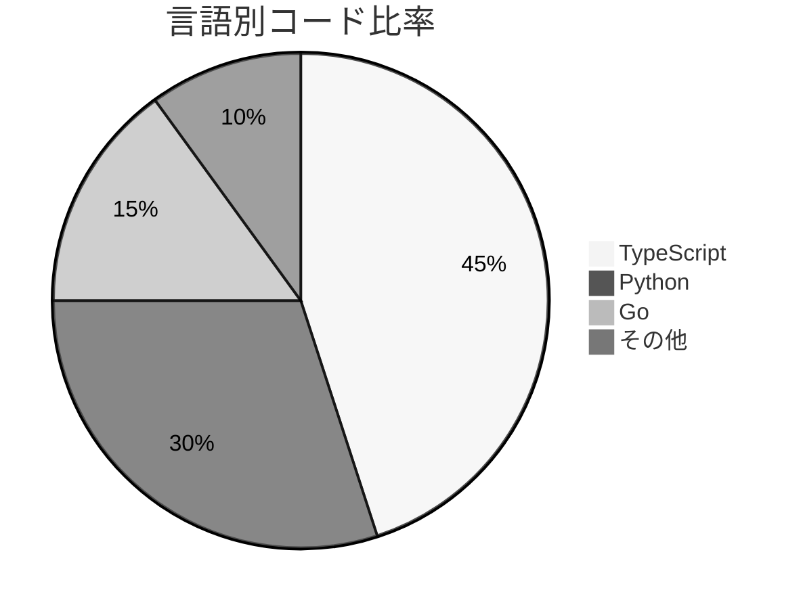
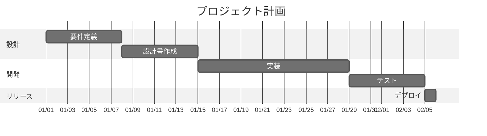

# モダンスライドテンプレート

発表者名 (Your Name)
所属組織 (Your Affiliation)
September 1, 2025

---

# 目次

01. はじめに
02. 基本的なコンテンツ
03. レイアウトと視覚要素
04. 情報を整理する要素
05. 表 (Table) の作成
06. 専門的なコンテンツ
07. 定理環境
08. カラムレイアウト
09. 参考文献
10. おわりに

---

<!-- _class: section -->

# 01

## このテンプレートの目的と使い方

### はじめに

INTRODUCTION

---

## テンプレートの設計方針と使い方

このテンプレートは、実用性を重視し、様々な用途に対応できるよう設計されています。

- 思想: コンテンツの伝わりやすさを最優先とし、デザインはシンプルに徹しています。
- 活用法: このファイル自体が、各種要素の書き方をまとめたチートシートになっています。必要なスライドのコードをコピーし、書き換えていくことで、効率的に資料を作成できます。

---

<!-- _class: section -->

# 02

## テキストと箇条書きの基本操作

### 基本的なコンテンツ

BASIC CONTENT

---

## 見出しのレベル

`#` (h1) はセクションスライドの章番号に使います。`##` (h2) はスライドタイトルで, このスライドの「見出しのレベル」がその例です。コンテンツ内の小見出しには `###` 以降を使います。

### h3: 小見出し

#### h4: h3 と同サイズ

##### h5: h3 と同サイズ

###### h6: h3 と同サイズ

通常の本文テキストです。このテーマでは h3〜h6 はすべて同じサイズです。

---

## 文字サイズの調整

HTML タグを使うことで、文字サイズを調整できます。

- <small>小さい文字</small>
- 通常の文字
- ### 少し大きい文字
- # とても大きい文字

---

## 文字の装飾: 太字

テキストの一部を強調したい場合に、太字を使用します。

- これは通常のテキストです。
- これは **太字** を使用したテキストです。
- 文の **一部分だけ** を強調することもできます。

---

## 番号なしリスト

階層構造を持つ箇条書きで、情報を整理する際に使用します。

- 項目 A
- 項目 B
  - サブ項目 B1
  - サブ項目 B2
- 項目 C

---

## 番号付きリスト

手順やランキングなど、順序が重要な項目を列挙する際に便利です。

1. 最初のステップ
2. 次のステップ
3. 最後のステップ

---

## URL の記載方法

投影時は埋め込みリンクが視認できないため、脚注に URL を記載します。

- 本文中に参照記号を置きます: Google 検索<sup>†</sup>
- スライド下部の脚注に URL を記載します。

<!--
_footer: "† https://www.google.co.jp/"
-->

---

## 脚注の使い方

スライドの下部に、補足情報として脚注を配置できます。

- 各スライドに脚注<sup>†</sup>を追加できます。
- 脚注のマーカー<sup>††</sup>は手動で付けます。
- 3 つ目の脚注<sup>†††</sup>はこのように表示します。

<!--
_footer: "† これは最初の脚注です。　†† 脚注マーカーは手動で付けます。　††† 脚注のテキストはスライド下部に配置します。"
-->

---

<!-- _class: section -->

# 03

## なぜ視覚的階層がメッセージの伝達力を左右するのか?

### レイアウトと視覚要素

LAYOUT & VISUAL ELEMENTS

---

## 絵文字の利用（表示例）

絵文字は、視覚的なアクセントを加え、情報の伝達を助けるために効果的です。

- ✅ タスク完了
- 🚀 新規プロジェクトのローンチ
- 📈 売上の向上
- ⚠️ 注意事項: 予算の見直しが必要です。
- 💬 ご意見をお聞かせください。

TPO に合わせて、適切に使用することが重要です。

---

## 画像の挿入

`` の形式で幅を指定して画像を挿入します（`w` は `width` の短縮形）。


*Mandelbrot set*

---

## 画像のサイズ指定

サイズは CSS 長さ単位（`px`・`cm` 等）で指定します。パーセント（`%`）は使用できません。

```markdown
           <!-- 幅を固定（高さは比率を維持）-->
           <!-- 高さを固定（幅は比率を維持）-->
   <!-- 幅と高さを両方指定（比率が崩れる場合あり）-->
```

| 記法 | 効果 |
| :--- | :--- |
| `w:Npx` / `width:Npx` | 幅を固定（高さは比率を維持）|
| `h:Npx` / `height:Npx` | 高さを固定（幅は比率を維持）|
| `w:Npx h:Mpx` | 幅と高さの両方を固定 |

---

<!-- _class: section -->

# 04

## 情報の構造化と視覚的整理

### 情報を整理する要素

ORGANIZING INFORMATION

---

## 情報ボックスの利用: Note

補足情報や注釈を示したい場合に、引用ブロックを使用できます。

> **Note**
> ここにノートの本文を記述します。このテキストは、ユーザーがコンテンツをざっと見ているときでも知っておくべき有用な情報です。複数行にわたる文章も自動で改行されます。

---

## 情報ボックスの応用: Alert と Hint

タイトルを変えることで、注意喚起やヒントなどの用途に展開できます。

> **Alert**
> これは警告メッセージです。重要な情報や注意を促す内容を記述します。

> **Hint**
> これはヒントです。補足情報や便利なティップスなどを記述するのに適しています。

---

<!-- _class: section -->

# 05

## データをわかりやすく伝えるために

### 表 (Table) の作成

CREATING TABLES

---

## 基本的な表

<style scoped>
section { --body-scale: 0.75; }
</style>

Markdown の表記で、情報を表形式に整理できます。

- 思想: 縦線を少なくし、横方向の情報を読みやすくします。
- 記法: パイプ `|` と区切り線 `---` を使用します。

| 項目 | 説明 | 数値 |
| :--- | :--- | ---: |
| アイテム A | これはアイテム A に関する少し長めの説明文で、<br>セルの幅を超えると折り返しが発生します | 1,234 |
| アイテム B | B は非常に重要な項目であり、<br>詳細な説明が必要なケースを想定したサンプルテキストです | 56 |
| アイテム C | C の説明文。短め。 | 7,890 |
| アイテム D | 複数の要素を含む説明：<br>パフォーマンス改善・コスト削減・<br>保守性向上・スケーラビリティの確保 | 12,345 |

---

<!-- _class: section -->

# 06

## 数式・コード・技術的な表現

### 専門的なコンテンツ

ADVANCED CONTENT

---

## 数式の表示

文中に数式を埋め込むことができます。例: アインシュタインの有名な式 $E = mc^2$。

また、独立した数式環境も利用可能です。

$$
\sum_{n=1}^{\infty} \frac{1}{n^2}
= 1 + \frac{1}{2^2} + \frac{1}{3^2} + \cdots
= \frac{\pi^2}{6}
$$

$$
\int_{0}^{\infty} e^{-a x^2} dx
= \frac{1}{2}\sqrt{\frac{\pi}{a}}
$$

$$
\lim_{x \to \infty} \frac{\sin x}{x} = 1
$$

---

## ソースコードのハイライト

Python のコードの例です。

```python
def fibonacci_generator():
    """フィボナッチ数列を生成する"""
    a, b = 0, 1
    while True:
        yield a
        a, b = b, a + b

fib_gen = fibonacci_generator()
fib_numbers = [next(fib_gen) for _ in range(15)]
print(fib_numbers)
```

---

## 図の描画: Mermaid（フローチャート）

`look: handDrawn` を指定すると手書き風のスタイルになります。



---

## 図の描画: Mermaid（ステートダイアグラム）



---

## 図の描画: Mermaid（クラス図）



---

## 図の描画: Mermaid（円グラフ）



---

## 図の描画: Mermaid（ガントチャート）



---

<!-- _class: section -->

# 07

## 数学的な構造を明示する

### 定理環境

THEOREM ENVIRONMENTS

---

## 定理環境の使い方

<style scoped>
section { --body-scale: 0.6; }
</style>

`<div class="クラス名">` の直後に空行を入れると、中身は Markdown としてレンダリングされます。**第 1 段落がラベル行**になります。

```markdown
<div class="thm">

**Thm. 1.1** *中間値の定理*

$f$ が閉区間 $[a, b]$ 上で連続で $f(a) < k < f(b)$ ならば...

</div>
```

| クラス | 用途 | 色 |
| :--- | :--- | :--- |
| `def` | 定義 | 赤（アクセント） |
| `thm` | 定理 | 青 |
| `cor` | 系 | 青（薄め） |
| `ex` | 例 | グレー |
| `proof` | 証明 | 薄色 + 自動 Proof. ラベル |

---

## 定義・定理・証明

<div class="def">

**Def. 3.1** *連続関数*

関数 $f: X \to Y$ が点 $a \in X$ で連続であるとは、任意の $\varepsilon > 0$ に対してある $\delta > 0$ が存在し、$|x - a| < \delta \Rightarrow |f(x) - f(a)| < \varepsilon$ が成り立つことをいう。

</div>

<div class="thm">

**Thm. 3.2** *中間値の定理*

$f$ が閉区間 $[a, b]$ 上で連続で $f(a) < k < f(b)$ ならば、$f(c) = k$ を満たす $c \in (a, b)$ が存在する。

</div>

<div class="proof">

$S = \{x \in [a,b] \mid f(x) \le k\}$ とおく。$S$ は空でなく有界なので $c = \sup S$ が存在する。$f(c) \neq k$ と仮定すると $f$ の連続性から矛盾が生じるため $f(c) = k$。

</div>

---

## 系・例

<div class="cor">

**Cor. 3.3**

閉区間上の連続関数の像は閉区間である。

</div>

<div class="ex">

**Ex. 3.4**

$f(x) = x^2 - 2$ は $[0,\,2]$ 上で連続で $f(0) = -2 < 0$、$f(2) = 2 > 0$ であるから、中間値の定理により $f(c) = 0$ を満たす $c \in (0, 2)$ が存在する。

</div>

---

<!-- _class: section -->

# 08

## テキスト・画像・カードを横並びに整理する

### カラムレイアウト

COLUMN LAYOUTS

---

## カラムレイアウト: テキスト 2 カラム

<style scoped>
section { --body-scale: 0.8; }
</style>

`.cols` はテキスト・画像・カードを問わず, 横並びに配置する汎用グリッドです。

<div class="cols">
<div>

メリット

- 視覚的な整理がしやすい
- 比較・対照に適している
- 情報の階層が明確になる

</div>
<div>

活用場面

- 選択肢の比較
- 手順の並列提示
- 機能・特徴の列挙

</div>
</div>

---

## カラムレイアウト: 画像と本文

`.cols` に画像と本文を並べる例です。`style="grid-template-columns: 1fr 2fr"` で比率を変えられます。

<div class="cols">
<div>


</div>
<div>

画像はグリッド列幅に自動的に収まります。

- 画像・テキスト・リストなど任意の内容を並べられます
- セルごとに内容の種類が違っても構いません

</div>
</div>

---

## カラムレイアウト: カードスタイル 3 カラム

<style scoped>
section { --body-scale: 0.72; }
</style>

子要素に `.card` クラスを付けると, 先頭の段落が見出しとして強調され, 下線で本文と区切られます. `--card-accent` で下線の色を変えられます.

<div class="cols">
<div class="card">

**グリッドシステム**

コンテンツを整理し、一貫したレイアウトを実現するための基盤となる構造です。余白の配分と要素の配置ルールを定義することで、視覚的な秩序を保ちます。

</div>
<div class="card">

**タイポグラフィ**

フォントの選定、サイズ、ウェイトの組み合わせによって情報の優先順位を視覚的に表現します。読みやすさとデザイン性のバランスが重要です。

</div>
<div class="card">

**カラーパレット**

配色の統一とアクセントカラーの戦略的な使用でブランドを表現します。色彩心理を考慮した選定がメッセージ性を強めます。

</div>
</div>

---

## カラムレイアウト: カードスタイル 4 カラム

<style scoped>
section { --body-scale: 0.65; }
</style>

<div class="cols">
<div class="card">

Step 1

課題を定義し、解決すべき問いを明確にします。

</div>
<div class="card">

Step 2

情報を収集し、仮説を立てます。

</div>
<div class="card">

Step 3

プロトタイプを作成し、検証します。

</div>
<div class="card">

Step 4

結果を評価し、次のサイクルへ反映します。

</div>
</div>

---

## カラムレイアウト: 比較

<style scoped>
section { --body-scale: 0.8; }
.card:last-child { --card-accent: var(--accent); }
</style>

子要素に `.card` クラスを付けると, 先頭の段落が見出しとして強調され, 下線で本文と区切られます. `--card-accent` で下線の色を変えられます.

<div class="cols">
<div class="card">

**従来の方法**

- 手作業が多い
- エラーが発生しやすい
- 時間とコストがかかる
- 属人的なフロー

</div>
<div class="card">

**新しいアプローチ**

- 自動化による効率化
- 精度の向上
- コスト削減
- 標準化されたプロセス

</div>
</div>

---

<!-- _class: section -->

# 09

## 引用・出典の一覧

### 参考文献

REFERENCES

---

## 参考文献

- 著者名, 「タイトル」, 出版社, 年.
- 著者名, 「タイトル」, 学会誌名, vol. X, no. Y, pp. Z–ZZ, 年.
- 著者名, "Title," *Journal Name*, vol. X, no. Y, pp. Z–ZZ, Year.

---

<!-- _class: section -->

# 10

## ご清聴ありがとうございました

### おわりに

CLOSING

---

## おわりに

ご清聴ありがとうございました。

ご質問・ご意見がありましたら、お気軽にどうぞ。
