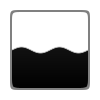

# Todoアイコンパターン比較

3種類のアイコンセットを並べて比較する。

---

## checkbox パターン

チェックボックスで完了・未完了を示すアイコンセット。一般的な ToDo リストに馴染みやすい。

-  未着手: 空のボックス
-  進行中: 途中を示す横線
-  完了: チェック済み

---

## hourglass パターン

砂時計で進捗を表現したアイコンセット。残り作業量が視覚的に分かる。

-  未着手: 砂が上に溜まっている
-  進行中: 砂が途中まで落ちている
-  完了: 砂が下に溜まっている

---

## water パターン

丸い容器に水が溜まる表現。水位で進捗を示す。hourglass と同様に残り作業量が視覚的に分かる。

-  未着手: 水が少ししか入っていない
-  進行中: 水が半分まで溜まっている
-  完了: 水が上まで満杯
